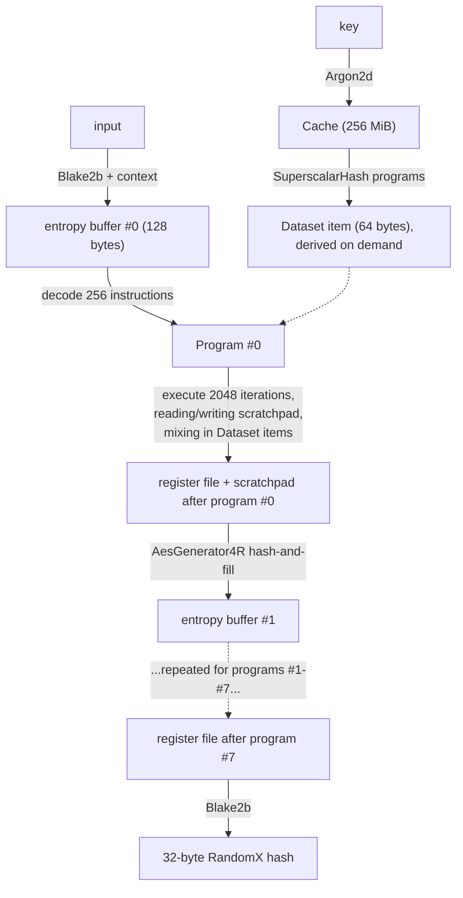

# RandomX Miner and Profiler

An educational Rust interface to **RandomX**, the proof-of-work hash
algorithm Monero has used since November 2019. Complete hashes use the
maintained RandomX reference backend, while independently useful stages
remain implemented in Rust and checked against official vectors.

Development follows **BDD** (Behavior-Driven Development): each stage of
the algorithm is first described as a Gherkin scenario with a known,
official expected result, and only then implemented until that scenario
goes green.

## Why RandomX?

Most proof-of-work algorithms (like Bitcoin's SHA-256) are trivial to
implement efficiently in dedicated hardware (ASICs), which centralizes
mining around whoever can afford that hardware. RandomX is designed
specifically to resist this: it dynamically generates and executes
semi-random *programs* using general-purpose CPU instructions (integer
math, floating point math, branches) and leans on large, slow memory
("memory-hard") so that a regular CPU is close to the most efficient way
to compute it. There is no fixed circuit to bake into an ASIC — every hash
runs different code.

## Hashing Versus Brute-Force Mining

RandomX itself is deterministic: for a fixed `key` and `input`, it always
returns the same 256-bit digest. It does not search for a result internally.
The brute-force search happens outside the hash function. For each candidate
nonce, a miner changes the block header supplied as `input`, runs RandomX, and
checks whether the digest satisfies the network target:

```text
header with nonce 0 -> RandomX -> digest 0 -> target check
header with nonce 1 -> RandomX -> digest 1 -> target check
header with nonce 2 -> RandomX -> digest 2 -> target check
...
```

RandomX makes each trial expensive in general-purpose CPU resources and
memory. Since the digest behaves pseudorandomly, a miner cannot infer a
successful nonce from nearby failures. If one candidate has probability $p$ of
meeting the target, the expected search effort is $1/p$ hashes. A verifier
performs the same deterministic calculation once for the claimed block.

The `key` is held constant across many candidate inputs. Its Cache and other
key-derived state can be reused, while input-dependent VM execution is
repeated for each nonce.

## Project status

The light-mode hash pipeline is complete and passes the official RandomX
hash vectors. Cache initialization, AES generation, dataset register
seeding, and reciprocal arithmetic also have stage-level vector tests.
Telemetry reports wall time, process CPU time, CPU share, and attributed
memory for cache initialization, VM initialization, and hash execution.

The full VM, superscalar generator, Dataset expansion, and JIT are supplied
by `randomx-rs`, which builds the maintained RandomX C++ implementation.

## How a single RandomX hash is computed

`calculate_hash(key, input) -> [u8; 32]` is the entire algorithm, and it
takes exactly two byte strings in:

- **`key`** — in Monero, the hash of a designated "key block" from the
  chain. It changes rarely (roughly every 2048 blocks, ~2.8 days), and
  everything derived from it alone (Cache, superscalar programs, Dataset)
  is expensive to (re)compute but can be reused across millions of hashes.
  It's an input to the algorithm, not a secret — anyone verifying a block
  recomputes the same Cache from the same public key block.
- **`input`** — the actual thing being hashed on each attempt: in Monero,
  the block header ("blob") with a candidate `nonce` value plugged in. This
  is what changes on *every single guess* in the brute-force mining loop
  (see the "brute force" discussion earlier in this conversation) — the
  miner holds `key`'s derived state fixed and just swaps `input` (i.e. the
  nonce) millions of times per second, computing a fresh `calculate_hash`
  for each one and checking the result against the difficulty target.

A real miner reuses the expensive `key`-derived state (the Cache/Dataset)
across all those `input` values; this project starts by treating the whole
thing as one call so the mechanics are clear, before optimizing reuse.

### From input to output: how the pieces connect

Each stage below both *consumes* something from the stage before it and
*produces* something the next stage needs — nothing is computed in
isolation. At a glance:



So concretely: `key` only ever feeds the Cache/Dataset side (left branch);
`input` only ever seeds the *first* program's entropy (right branch); from
there, the 8 programs form one long chain where each program's finished
register state becomes the seed for the next program, occasionally reading
from the Dataset (which is only a function of `key`, never of `input`).
The very last program's register file is the one and only thing that gets
turned into the final 32-byte output.

### What makes one trial CPU- and memory-heavy

- **Argon2d Cache initialization** uses 256 MiB and data-dependent memory
  accesses. It is key-dependent and normally reused across many trials.
- **Dataset access** derives 64-byte items from the Cache in light mode. This
  saves the roughly 2 GiB fast-mode Dataset but spends more CPU time per
  access.
- **Generated programs** create different integer, floating-point, branch,
  and memory instructions from the changing input state.
- **Scratchpad execution** repeatedly accesses a 2 MiB per-hash scratchpad
  for 8 chained programs, each with 256 instructions executed for 2048
  iterations.

The result is a deliberately costly trial with latency-sensitive CPU work and
a substantial memory footprint. The CLI telemetry shows measured wall time,
process CPU time, CPU share, and attributed memory for cache initialization,
VM initialization, and hash execution.

### 1. Cache — turning the key into 256 MiB of noise

*Module: [`src/cache.rs`](src/cache.rs)* — **consumes:** `key`. **produces:** the Cache.

RandomX runs [Argon2d](https://en.wikipedia.org/wiki/Argon2) (the
data-dependent variant of the password-hashing function Argon2) over the
key to produce a 256 MiB block of pseudo-random bytes called the **Cache**.
Argon2d itself is memory-hard and slow by design, which is exactly why
RandomX reuses this result across many hashes rather than recomputing it
every time.

Fixed parameters (see [`src/params.rs`](src/params.rs)):
- password = the key `K`
- salt = the literal bytes `"RandomX\x03"`
- 3 iterations, 1 lane (no parallelism), 262144 KiB (256 MiB) of memory

### 2. SuperscalarHash — expanding the Cache into a Dataset on demand

**Native RandomX backend** — **consumes:** the Cache (indirectly, `key`). **produces:** Dataset items, computed one at a time whenever step 4c asks for one.

The *real* memory-hard structure RandomX wants you to have is the
**Dataset**: over 2 GiB of pseudo-random data. Keeping all 2 GiB resident
is called **fast mode** — it's what a real miner uses because it's fast.
But requiring 2 GiB just to *verify* one hash would be unfriendly to
lightweight nodes, so RandomX also defines **light mode**: instead of
storing the Dataset, each 64-byte Dataset item is derived on the fly from
the 256 MiB Cache. Both modes are required to produce identical hashes.

The derivation isn't just "hash a chunk of the Cache" (too cheap to be
memory-hard on its own) — it mixes 8 pseudo-random reads from the Cache
through one of 8 generated **superscalar programs**: short, fixed
sequences of integer instructions (multiply, add, xor, rotate...) designed
by RandomX's authors to require significant *latency* (dependent
instruction chains) to compute, not just memory bandwidth. This is what
makes light mode slow but low-memory, and fast mode fast but memory-hungry
— both arrive at the same answer.

This project implements **light mode first**, since it's simpler to get
correct (only needs the 256 MiB Cache), even though it's much slower.

### 3. Seeding the first program

**Consumes:** `input`. **produces:** the entropy buffer for program #0.

`input` is hashed (Blake2b) together with a small amount of fixed context
to produce the first 128-byte "entropy" buffer. Every subsequent program's
entropy buffer instead comes from the *previous* program's execution
(step 4d below) — this is what chains the 8 programs together into one
hash, and why RandomX can't be parallelized across programs within a
single hash.

### 4. Running 8 chained programs

**Native RandomX VM and [`src/aes_generator.rs`](src/aes_generator.rs)** — **consumes:** an entropy
buffer (from step 3, or from the previous round's step 4d) and Dataset
items (step 2). **produces:** an updated register file/scratchpad, and
(via 4d) the entropy buffer for the next round.

RandomX executes `RANDOMX_PROGRAM_COUNT` = **8** programs back-to-back,
each built and torn down using the previous program's leftover state.
For each of the 8 rounds:

**a. Generate the program.** The current 128-byte entropy buffer is
expanded (via `AesGenerator1R`, a fixed-key AES round function used purely
as a fast bit mixer, not for secrecy) into 256 instructions of 8 bytes
each — an opcode byte, two operand/register bytes, and a 4-byte immediate.
Each instruction decodes into one of roughly 30 operation types: integer
add/sub/mul/xor/rotate, floating point add/sub/mul/div/sqrt, conditional
branches, and scratchpad loads/stores. Because the entropy buffer differs
every round, the *program itself* — not just the data — is different every
time. That's the "random" in RandomX.

**b. Load the register file.** 8 signed 64-bit integer registers
(`r0..r7`) and 12 floating point registers (grouped `f0..f3`, `e0..e3`,
`a0..a3`) are initialized from the same entropy buffer. Two of the integer
registers (`ma`/`mx`) hold scratchpad addresses used for reads/writes.

**c. Fill/mix the scratchpad and execute.** The 2 MiB **scratchpad** (the
VM's private, per-hash working memory — much smaller than the Cache/
Dataset, and addressed at three granularities: 16 KiB / 256 KiB / 2 MiB
windows, `L1`/`L2`/`L3` in [`src/params.rs`](src/params.rs)) is
AES-filled at the start of a hash. The program's 256 instructions then run
in a loop for `RANDOMX_PROGRAM_ITERATIONS` = **2048** iterations. Each
iteration executes all 256 instructions in sequence, reading and writing
scratchpad bytes at addresses derived from the integer registers, and
periodically pulling a 64-byte item out of the Dataset (step 2) to mix in
— this is the actual memory-hard access pattern that makes the algorithm
expensive to shortcut.

**d. "Hash and fill".** After the 2048 iterations, the register file is
mixed into the scratchpad via `AesGenerator4R` (four AES rounds per step
instead of one — slower, used here instead of at scratchpad-fill time
because this step also has to *consume* the existing scratchpad content,
not just produce new bytes). The output doubles as the entropy buffer for
the *next* program, chaining round `i` into round `i+1`.

### 5. Finalizing the hash

**Consumes:** the register file left behind by program #7 (the 8th and
last program). **produces:** the final output.

The final register file (all int + float registers) is hashed with
**Blake2b** to produce the 32-byte digest. That digest is the RandomX
hash — what Monero compares against the network difficulty target. No
step after this one exists; this Blake2b call's output is literally what
`calculate_hash` returns.

## Repository layout

```
src/
  lib.rs             Top-level calculate_hash() and the full pipeline walkthrough
  params.rs          Fixed RandomX constants (from the official spec)
  cache.rs           Stage 1: Argon2d-derived Cache
  dataset.rs          Dataset-item register seeding helper
  reciprocal.rs        The IMUL_RCP reciprocal helper (pure integer math)
  aes_generator.rs    Stage 4: AesGenerator1R / AesGenerator4R
  telemetry.rs        Wall time, CPU time, CPU share, and memory reporting
  main.rs             CLI entry point (prints one hash and telemetry)
features/
  reciprocal/          Per-step: the IMUL_RCP reciprocal function
  cache/               Per-step: Argon2d cache spot-checks
  dataset/             Per-step: Dataset item register seeding
  aes_generator/       Per-step: AesGenerator1R
  full_hash/           Integration: the whole pipeline combined
tests/
  cucumber_reciprocal.rs    Step definitions for features/reciprocal/
  cucumber_cache.rs         Step definitions for features/cache/
  cucumber_dataset.rs       Step definitions for features/dataset/
  cucumber_aes_generator.rs Step definitions for features/aes_generator/
  cucumber.rs               Step definitions for features/full_hash/
```

Each exposed stage gets its own feature folder and matching test binary, with
known-good input/output values. This follows the same
each-step-then-the-whole-thing approach used when testing a hash block by
block before testing the full digest.

## Running the tests

Building `randomx-rs` requires CMake and a C++ compiler. On Windows, install
CMake and the Desktop development with C++ workload for Visual Studio.

Run the default vector and print its telemetry:

```powershell
cargo run --release
cargo run --release -- "test key 000" "This is a test"
```

```powershell
cargo test                          # every suite, step-level and full-hash
cargo test --test cucumber_reciprocal
cargo test --test cucumber_cache
cargo test --test cucumber_dataset
cargo test --test cucumber_aes_generator
cargo test --test cucumber          # full end-to-end hash (features/full_hash/)
```

Each suite runs the Gherkin scenarios in its `features/<stage>/` folder
against the corresponding module. Expected values are the official
reference test vectors from the upstream
[RandomX repository](https://github.com/tevador/RandomX)'s test suite
(`src/tests/tests.cpp`) wherever those exist; the Dataset register-seeding
scenarios were instead computed independently from the documented formula
(`doc/specs.md` section 7.3), as a cross-check on the constants themselves.
A fully correct implementation should make every scenario pass without any
test changes.

## Running the binary

```powershell
cargo run
```

The binary computes the default reference hash and prints its telemetry. You
can provide a key and input explicitly:

```powershell
cargo run --release -- "test key 000" "This is a test"
```

To model a mining loop, vary the nonce in the input and call the hash function
for each candidate, then compare each digest with a target. This educational
CLI exposes the single-trial computation; it does not implement a nonce range
or network difficulty target.

## References

- [RandomX repository (tevador/RandomX)](https://github.com/tevador/RandomX) — the reference C++ implementation and specification (`doc/specs.md`, `doc/design.md`)
- [Monero's RandomX proof-of-work documentation](https://www.getmonero.org/resources/moneropedia/randomx.html)
